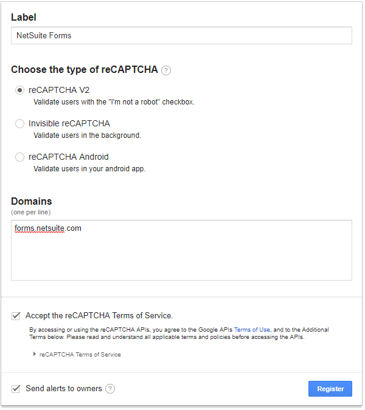
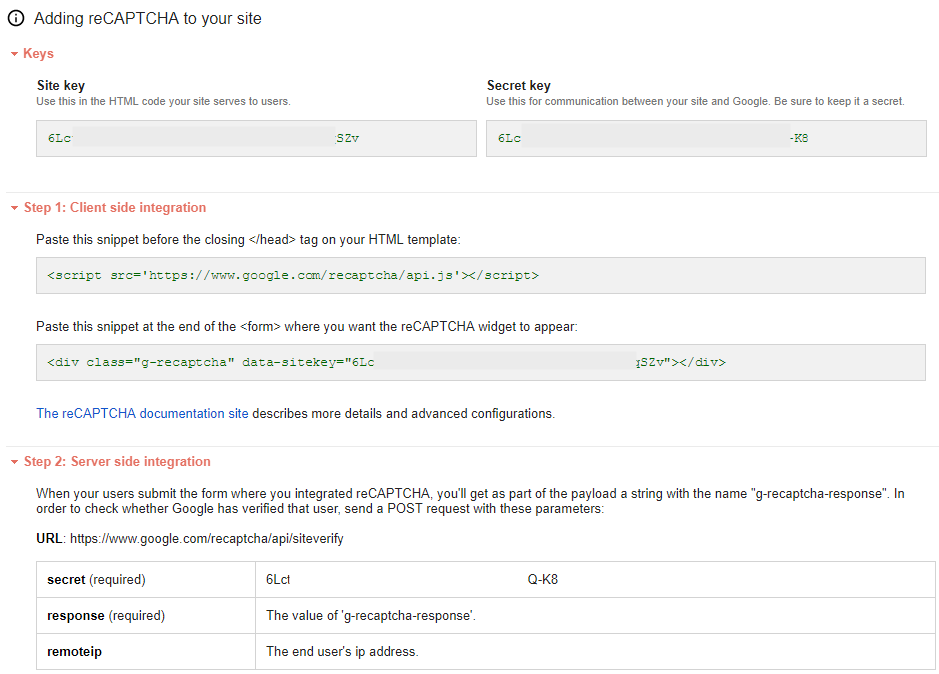
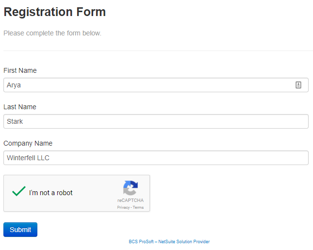

# NetSuite reCAPTCHA v2
The purpose of this project was to implement Google reCAPTCHA v2 on embedded NetSuite forms. It contains a simple HTML form template that calls the reCAPCTHA JavaScript file to validate the input. The biggest challenge with this is actually implementing it within NetSuite and the fact that NetSuite's placeholders for form fields must be used instead of HTML inputs. 

# How to Run this Project
I originally wrote instructions to implement this project at [How to Integrate NetSuite Forms with reCAPTCHA](https://blog.bcsprosoft.com/how-to-integrate-netsuite-forms-recaptcha). This link has been updated a few times so I'm including it here for safekeeping.

## Background
Google reCAPTCHA is a service that protects you against spam and other types of automated abuse. It appears as a box at the end of your form and requires you to take some action before submitting to prove that you’re a human.

NetSuite doesn’t provide a captcha field on its online forms via their SuiteScript API so an Administrator will have to implement this functionality for externally-facing forms. There are several tutorials already out there, but they all apply to reCAPTCHA V1, which is now obsolete and has been unsupported since 2016. Unfortunately, these posts fail to explain how integrate reCAPTCHA with your NetSuite forms in layman’s terms for non-developers like myself.

In this post, I’ll outline how I managed to get reCAPTCHA working with our website with HTML and a client-side SuiteScript without deploying a custom Suitelet. This post assumes you’re familiar with the basics of HTML and how to create Online Customer Forms in NetSuite. You should already have the following prerequisites:

- A Google Account (does not need to be Google Apps for Business)
- NetSuite Administrator Login Credentials
- User Access to Create Online Forms
- User Access to Create SuiteScripts

## 1. Obtain Your Google reCAPTCHA Site Key
First, we need to create our reCAPTCHA. This step requires a Google account, so if you don’t already use Gmail, you’ll need to create one. You can use your personal account if your company doesn’t use Google Apps, but be sure to make a coworker an Owner of the keys when prompted in case you ever leave the company or lose access to your account.

1.  Go to  [http://www.google.com/recaptcha](http://www.google.com/recaptcha).
2.  Click the link to Get reCAPTCHA and click Sign Up.
3.  Follow the steps to create a new reCAPTCHA V2.
4.  Enter your NetSuite Domain into the  _Domains_  section. For NetSuite online forms, it will be either  _forms.netsuite.com_  or  _forms.na1.netsuite.com_  depending on which data center your account is hosted. If you’re not sure you can go to one of your existing NetSuite forms and look at the  _Publisher Form URL_  under the  _External_  tab. 

5. Click Register and you will be presented with your reCAPTCHA site keys. Leave this page open as we’ll need to paste your site key into the HTML file later.

## 2. Create an HTML Template and Online Form
Now we’ll need to create a new Online Customer form from a custom HTML template since the default form template doesn’t support reCAPTCHA out of the box. For testing purposes, let’s create a form that only asks for the user’s first, last, and company name. This section will require you to make a small edit to the code, but we’ll take it step by step.

1.  Copy the HTML code above from the GitHub repository and paste it into a plain text editor such as Notepad.
2.  Copy your Site key from the reCAPTCHA settings (not the Secret key) making sure you only have the text copied and not and spaces before or after the string.
3.  In Notepad scroll down until you see “YOUR_RECAPTCHA_SITE_KEY” and paste the site key you just copied inside the quotation marks.
4.  Save the file as  _netsuite_recaptcha_online_form_template.html_. After you have saved the file, locate it in the folder and edit the name to remove the .txt file extension from the name if it automatically adds it.
5.  In NetSuite, create new form and select  _Custom HTML Template_. Give your form a name and under the  _Template_  field choose  _-New-_. Upload the HTML file you just created into the new window and click  _Save_  to close the window.
6.  Back on the Online Customer Form window, add the First Name, Last Name, and Company Name fields. Make sure the mandatory box is checked for each of them.
7.  Click Save and leave this window open.

## 3. Create a SuiteScript to Validate the Form
Previous versions of reCAPTCHA required you to create both a client-side and a server-side script to validate the form submission. However, Google’s new  [reCAPTCHA V2](https://developers.google.com/recaptcha/docs/display)  (where they ask you to click on images instead of typing words), now allows for client-side verification without having to submit the form.

1.  Download the GitHub repository or copy the code above and paste it into Notepad. Save the file as  _netsuite_recaptcha_cs.js_. After you have saved the file, locate it in the folder and edit the name to remove the .txt file extension from the name if it automatically adds it.
2.  In NetSuite, edit the form created in part 2 and navigate to the  _Custom Code_  tab.
3.  Click the plus icon to add a new file to the  _Script File_  field and upload the JavaScript file you just created.
4.  In the  _Save Record Function_  field enter  _onSubmit_
5.  Click Save and test the form.

## 4. Test the Form
That’s it! Your reCAPTCHA box should now appear and work correctly in your form. Go ahead and test your form by clicking on the External tab and viewing Publishable Form URL. Assuming you followed all of the steps above, your form should be working correctly. There are a number of reasons why you may get an error. A descriptive Google search and Stack Overflow are going to be your best friend here. However, try recreating the site key from scratch and making sure you have it added in your HTML form template. Especially if you’re using a site key previously used or one that may be for reCAPTCHA V1.

## Putting it all Together
If you followed the step above and have successfully added tested the reCAPTCHA validation on your NetSuite form, you won’t need to trouble your administrator each time you want to create a form.

# Sources 
This was originally published in 2017 by a blog I wrote titled "[How to Integrate NetSuite Forms with reCAPTCHA](https://blog.bcsprosoft.com/how-to-integrate-netsuite-forms-recaptcha)". It was based on a LinkedIn post by [Emil Olaguir, Jr.](https://pulse.tips/google-recaptcha-for-netsuite-online-forms_58df6fb61723dda223accbef.html) and a reCAPTCHA v1 form template created by [Benji Sicam](https://github.com/benjsicam). However, these sources are no longer available.